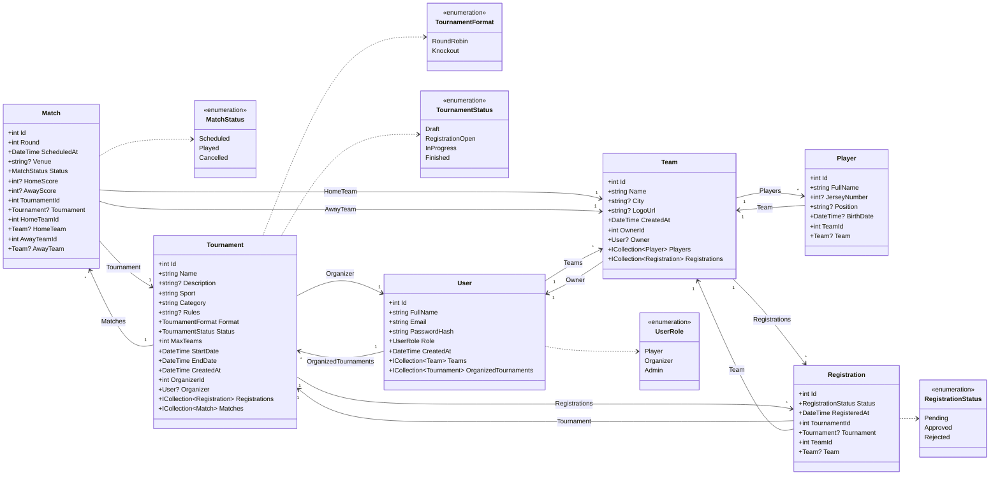

# Diagrama de clases — Dominio

> Documento generado automáticamente por `generate-documentation.yml` — no editar a mano.

Entidades del dominio (`backend/TorneoApi/Models`).

```mermaid
classDiagram
    direction LR
    class Match {
        +int Id
        +int Round
        +DateTime ScheduledAt
        +string? Venue
        +MatchStatus Status
        +int? HomeScore
        +int? AwayScore
        +int TournamentId
        +Tournament? Tournament
        +int HomeTeamId
        +Team? HomeTeam
        +int AwayTeamId
        +Team? AwayTeam
    }
    class MatchStatus {
        <<enumeration>>
        Scheduled
        Played
        Cancelled
    }
    class Player {
        +int Id
        +string FullName
        +int? JerseyNumber
        +string? Position
        +DateTime? BirthDate
        +int TeamId
        +Team? Team
    }
    class Registration {
        +int Id
        +RegistrationStatus Status
        +DateTime RegisteredAt
        +int TournamentId
        +Tournament? Tournament
        +int TeamId
        +Team? Team
    }
    class RegistrationStatus {
        <<enumeration>>
        Pending
        Approved
        Rejected
    }
    class Team {
        +int Id
        +string Name
        +string? City
        +string? LogoUrl
        +DateTime CreatedAt
        +int OwnerId
        +User? Owner
        +ICollection~Player~ Players
        +ICollection~Registration~ Registrations
    }
    class Tournament {
        +int Id
        +string Name
        +string? Description
        +string Sport
        +string Category
        +string? Rules
        +TournamentFormat Format
        +TournamentStatus Status
        +int MaxTeams
        +DateTime StartDate
        +DateTime EndDate
        +DateTime CreatedAt
        +int OrganizerId
        +User? Organizer
        +ICollection~Registration~ Registrations
        +ICollection~Match~ Matches
    }
    class TournamentFormat {
        <<enumeration>>
        RoundRobin
        Knockout
    }
    class TournamentStatus {
        <<enumeration>>
        Draft
        RegistrationOpen
        InProgress
        Finished
    }
    class User {
        +int Id
        +string FullName
        +string Email
        +string PasswordHash
        +UserRole Role
        +DateTime CreatedAt
        +ICollection~Team~ Teams
        +ICollection~Tournament~ OrganizedTournaments
    }
    class UserRole {
        <<enumeration>>
        Player
        Organizer
        Admin
    }
    Match ..> MatchStatus
    Match --> "1" Tournament : Tournament
    Match --> "1" Team : HomeTeam
    Match --> "1" Team : AwayTeam
    Player --> "1" Team : Team
    Registration ..> RegistrationStatus
    Registration --> "1" Tournament : Tournament
    Registration --> "1" Team : Team
    Team --> "1" User : Owner
    Team "1" --> "*" Player : Players
    Team "1" --> "*" Registration : Registrations
    Tournament ..> TournamentFormat
    Tournament ..> TournamentStatus
    Tournament --> "1" User : Organizer
    Tournament "1" --> "*" Registration : Registrations
    Tournament "1" --> "*" Match : Matches
    User ..> UserRole
    User "1" --> "*" Team : Teams
    User "1" --> "*" Tournament : OrganizedTournaments
```
