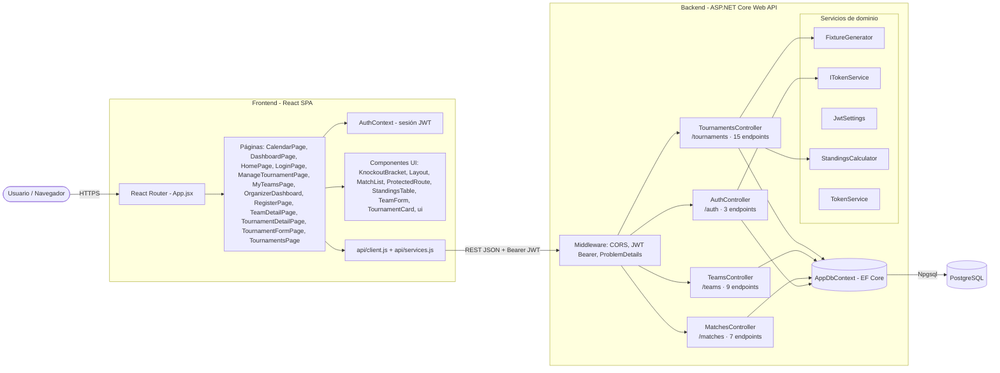

# Diagrama de componentes

> Documento generado automáticamente por `generate-documentation.yml` — no editar a mano.

Componentes del frontend React, la API ASP.NET Core y la base de datos.

```mermaid
flowchart LR
    user([Usuario / Navegador])
    subgraph FE[Frontend - React SPA]
        direction TB
        router[React Router - App.jsx]
        auth[AuthContext - sesión JWT]
        pages[Páginas: CalendarPage, DashboardPage, HomePage, LoginPage, ManageTournamentPage, MyTeamsPage, OrganizerDashboard, RegisterPage, TeamDetailPage, TournamentDetailPage, TournamentFormPage, TournamentsPage]
        comps[Componentes UI: KnockoutBracket, Layout, MatchList, ProtectedRoute, StandingsTable, TeamForm, TournamentCard, ui]
        apiclient[api/client.js + api/services.js]
        router --> pages --> comps
        pages --> auth
        pages --> apiclient
    end
    subgraph BE[Backend - ASP.NET Core Web API]
        direction TB
        mw[Middleware: CORS, JWT Bearer, ProblemDetails]
        AuthController["AuthController<br/>/auth · 3 endpoints"]
        MatchesController["MatchesController<br/>/matches · 7 endpoints"]
        TeamsController["TeamsController<br/>/teams · 9 endpoints"]
        TournamentsController["TournamentsController<br/>/tournaments · 15 endpoints"]
        subgraph SV[Servicios de dominio]
            FixtureGenerator[FixtureGenerator]
            ITokenService[ITokenService]
            JwtSettings[JwtSettings]
            StandingsCalculator[StandingsCalculator]
            TokenService[TokenService]
        end
        db[(AppDbContext - EF Core)]
        mw --> AuthController
        AuthController --> db
        AuthController --> ITokenService
        mw --> MatchesController
        MatchesController --> db
        mw --> TeamsController
        TeamsController --> db
        mw --> TournamentsController
        TournamentsController --> db
        TournamentsController --> FixtureGenerator
        TournamentsController --> StandingsCalculator
    end
    pg[(PostgreSQL)]
    user -->|HTTPS| router
    apiclient -->|REST JSON + Bearer JWT| mw
    db -->|Npgsql| pg
```
