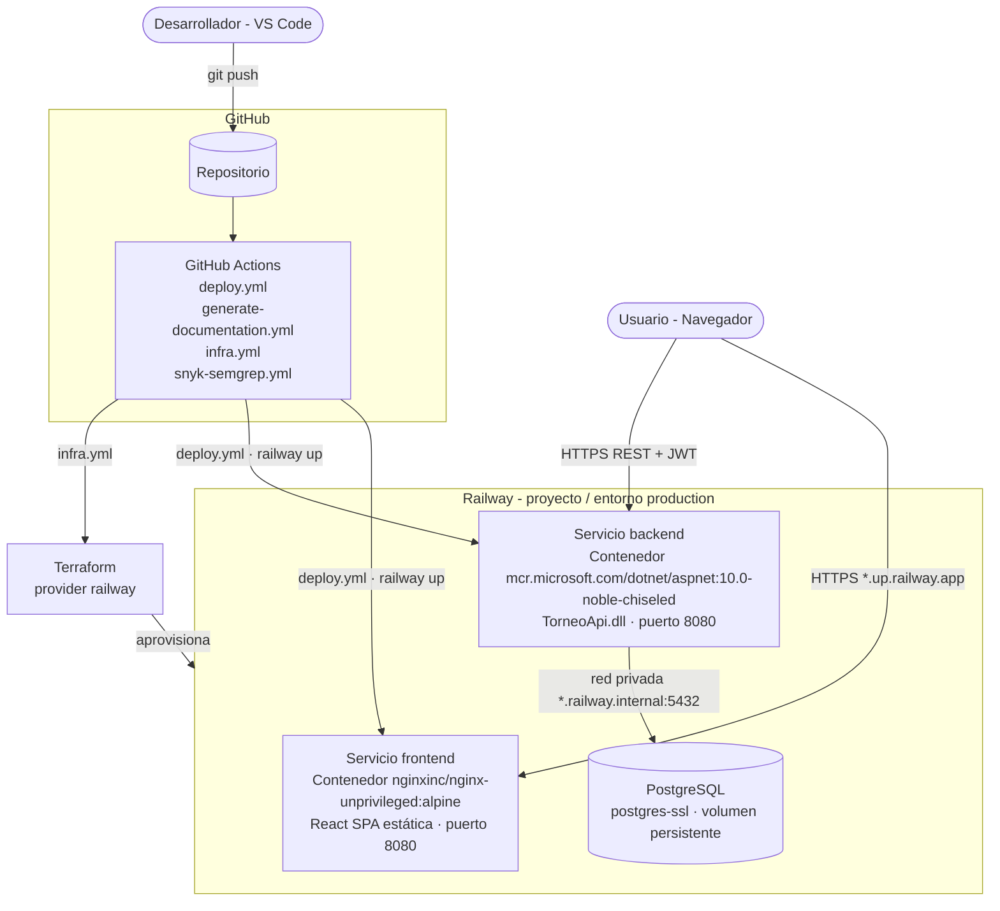

# Diagrama de despliegue

> Documento generado automáticamente por `generate-documentation.yml` — no editar a mano.

Infraestructura en Railway aprovisionada con Terraform y desplegada con GitHub Actions.

